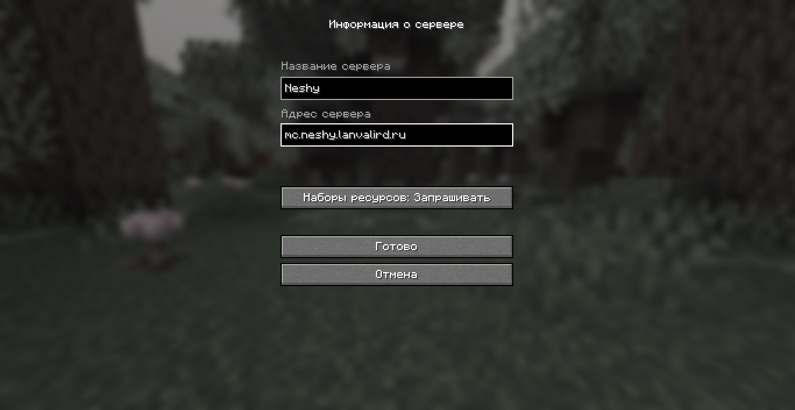
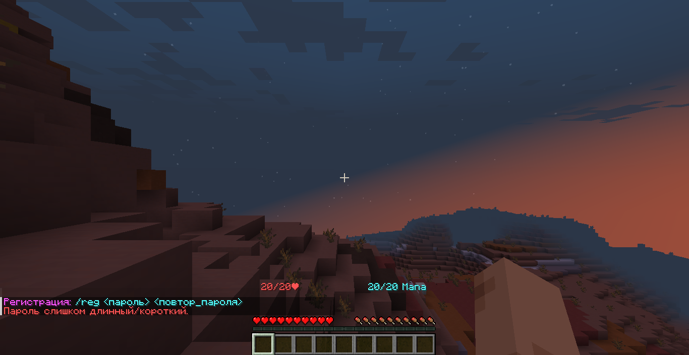
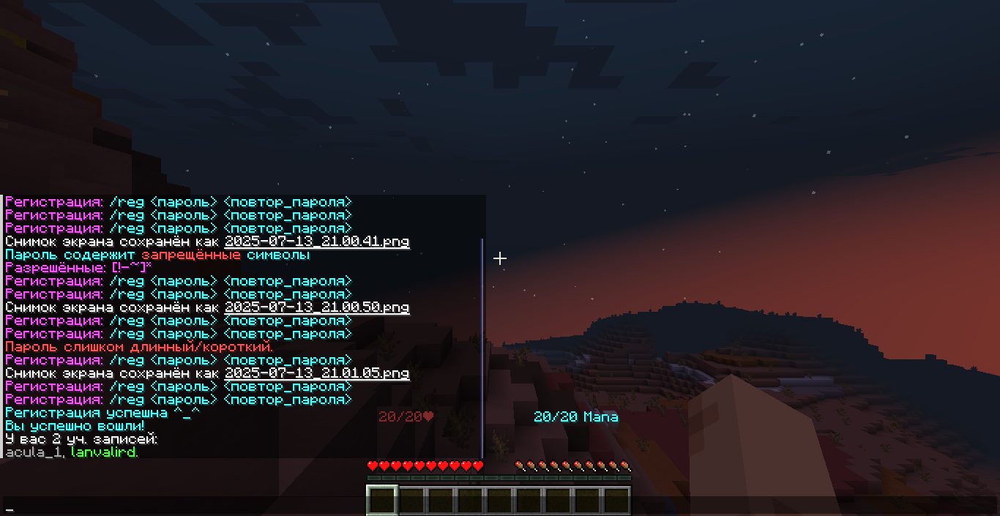

---

    title: Как сделать?
    
    description:
        Статья помогает разобраться в том, как начать игру и/или 
        что делать дальше.

    authors: [ lanvalird ]

---

## Регистрация

<!-- prettier-ignore -->
> [INFO]
> Процесс регистрации и входа ничем не отличается на Java и bedrock
> изданиях, кроме нативного интерфейса игры.

### Подготовка

Добавьте в список серверов следующий IP-адрес:

```txt
mc.neshy.lanvalird.ru
```



После чего убедитесь в том, что сервер запущен:


### Процесс

После того, как Вы убедились в работоспособности игрового серера —
подключитесь.

Если появятся ошибки, исправьте:



После чего сервер зарегистрирует и авторизирует Вас в системе:



## Вход

Если Вы до этого успешно зарегистрировались, то сервер автоматически
авторизирует Вас, но в противном случае просто впишите:
`/l <ваш_пароль>`.

Сессия хранится _(на момент написания статьи, 15.07.2025)_ 3-6 часов
_(автор не помнит точное время)_. За это время Вам не надо будет
заново входить аккаунт, даже если Вы недавно вышли с сервера
_(но не из учётной записи)_. После перезапуска или по истечении
срока хранения сессионной записи, придётся войти заново, если до
этого вышли в главное меню игры.
