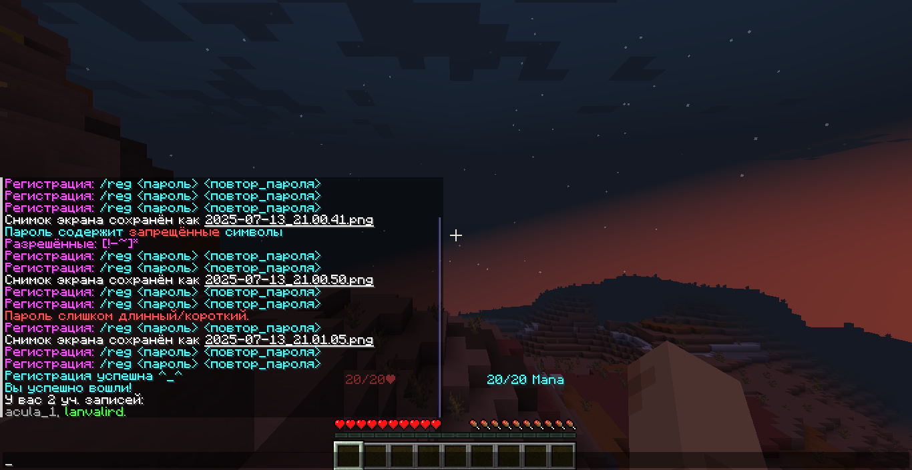

---

    title: Как сделать?
    
    description:
        Статья помогает разобраться в том, как начать игру и/или 
        что делать дальше.

    authors: [ lanvalird ]

---

import { Step, Steps } from "fumadocs-ui/components/steps";

## Регистрация [#registration]

<Callout title="Различия платформ" type="warn">
  Процесс регистрации и входа ничем не отличается на Java и Bedrock изданиях,
  кроме нативного интерфейса игры.
</Callout>

<Steps>
<Step>

### Подготовка [#registration-prepare]

Откройте версию игры выше 1.19.1 на Java издании, для Bedrock —
последнюю.

Добавьте в список серверов следующий IP-адрес:

```txt
mc.neshy.lanvalird.ru
```


После чего убедитесь в том, что сервер запущен:


</Step>
<Step>

### Процесс [#registration-process]

После того, как Вы убедились в работоспособности игрового сервера —
подключитесь. Дальше потребуется следовать уведомлениям на экране.

Скорее всего, вас попросят зарегистрироваться через следующую
команду:

```txt
/reg <ваш_пароль> <ваш_пароль>
```

</Step>
<Step>

### Казусы [#registration-errors]

Если появятся ошибки, исправьте, как подскажет уведомление:


</Step>
<Step>

### Успех [#registration-done]

После чего сервер зарегистрирует и авторизирует Вас в системе:



</Step>
</Steps>

## Вход [#login]

<Callout type="warn">
Если до этого Вы успешно прошли стадию регистрации, то сервер
автоматически авторизирует Вас, но в противном случае впишите в чат
команду:

```txt
/login <ваш_пароль>
```

</Callout>

Сессия хранится _(на момент написания статьи, 15.07.2025)_ 3-6 часов
_(автор не помнит точное время)_. За это время Вам не надо будет
заново входить аккаунт, даже если Вы недавно вышли с сервера
_(но не из учётной записи)_. После перезапуска или по истечении
срока хранения сессионной записи, придётся войти заново, если до
этого вышли в главное меню игры.
